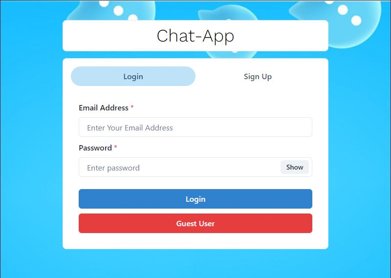

# Talk-Chat
 - Sign Up Page
 
 - Login Page
 
 - Chat Page
  
 -  Create group pop-up
# Talk_Chat Features
- Login Page
  - Registered User can enter their username and password 
  - Non registered user can use guest login for entering chats. 
- SignUp Page
  - Users are required to provide valid details like name, email, password and confirm password for registration. 
  - Adding images can also be done and its optional. 
  - After Signing up, the user can logihn into their account for chating.
- Chat Page
  - The chat page will have a text box on right side.
  - User information will be available on header panel.
  - User search can be performed with name or username.
  - Both individual and group chat can be done. 
  - User information can also be found in this page.
- Create Group
  - A group creation button is present in the left panel. 
  - User can create group with two or  more users.
  - User name can be searched and based on info group will be created by selecting users. 

# Summary 
  - A MERN Stack based chat application which uses Socket.Io for connection between two users and all the information are handled from Mongodb.
  - It allows users to sign up and using the details, users can login into the account for personal chating. 
  -  Users can add their friends by searching their profile. 
  - User can logout anytime by simple click. 
  In today's interconnected world, real-time communication is paramount. A MERN-based chat application offers a powerful solution to enable seamless interaction between users, fostering collaboration and engagement in various contexts.

- MongoDB:
    - At the heart of our chat application lies MongoDB, a versatile NoSQL database. MongoDB stores user profiles, message histories, and other relevant data in a flexible and scalable format. Its document-oriented architecture makes it ideal for managing dynamic, unstructured data such as chat messages.

- Express.js:
    - Express.js serves as the backend framework for our application, providing a robust foundation for handling HTTP requests and routing. With Express.js, we define API endpoints to manage user authentication, message sending, and other server-side functionalities. It interfaces seamlessly with MongoDB to perform CRUD operations on our data.

- React.js:
    - On the frontend, we harness the power of React.js to create a dynamic and responsive user interface. React's component-based architecture simplifies UI development, allowing us to build reusable and modular components for features such as chat rooms, message input forms, and user profiles. React's virtual DOM ensures efficient rendering and updates, providing a smooth user experience.

- Node.js:
    - Node.js powers the server-side logic of our application, enabling event-driven and non-blocking I/O operations. Asynchronous communication with the client is facilitated through WebSockets, allowing real-time message exchange without the need for continuous polling. Node.js coordinates communication between clients using the Socket.IO library, ensuring seamless interaction in a distributed environment.

- Socket.IO:
    - Socket.IO is instrumental in enabling real-time communication between clients and the server. It establishes a bidirectional connection, or "socket," between each client and the server, facilitating instant message delivery and updates. Socket.IO's event-driven architecture allows us to define custom events for handling message sending, receiving, and other interactions, ensuring a responsive and interactive chat experience.

